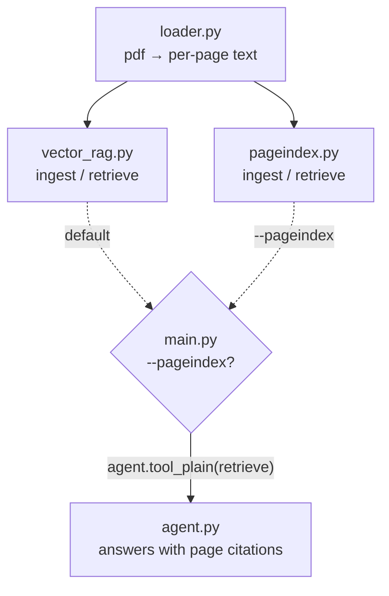
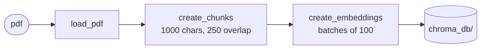
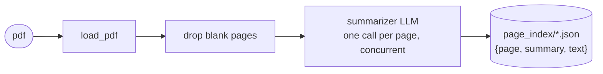
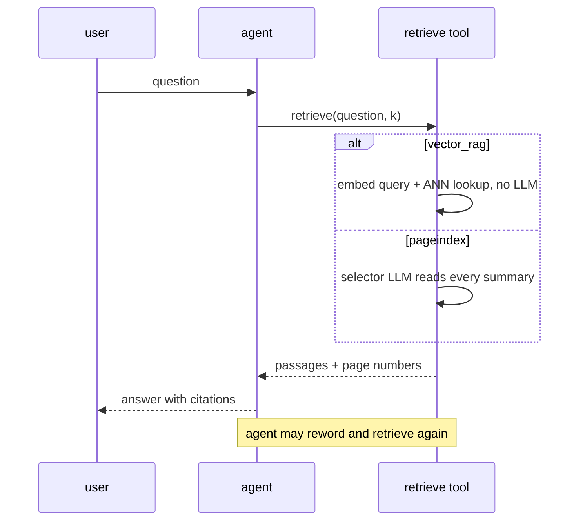

# vectorless-rag

Does RAG actually need vectors? "RAG" and "vector search" are used almost
interchangeably, and I wanted to find out how much of that is essential and how
much is habit.

So this repo builds the same question-answering pipeline over a PDF twice, on
the same document, the same questions, and the same answering agent, with the
retrieval strategy swappable by a single flag:

- **`vector_rag`**: the standard approach. Chunk the text, embed the chunks,
  store them in a vector database, retrieve by cosine similarity.
- **`pageindex`**: no embeddings at all. An LLM writes a one-sentence summary of
  every page at ingest, and at query time another LLM reads the list of summaries
  and picks which pages answer the question.

Both are implemented from the ground up: no LangChain, no LlamaIndex, no
framework `Retriever` class. Chunking, page-offset tracking, request batching,
index storage and retrieval are all hand-written; the only libraries involved
are PyMuPDF (pdf text), Chroma (vector store), and pydantic-ai (model calls and
typed outputs). That's deliberate: when nothing is hidden inside a framework
abstraction, every design decision in the comparison is visible in the diff.

The second one is the point of the project. Turns out you can do retrieval with
an index a human can read, and the tradeoffs are interesting rather than
obvious.

## Eval results

18 hand-written questions against a real 16-page document, gold pages
labelled by hand, run through both arms end to end (retrieval, answer,
citations). Full write-up, per-question breakdown, and reproduction
command: [`eval/REPORT.md`](eval/REPORT.md).

| metric | `vector_rag` | `pageindex` |
| --- | --- | --- |
| Retrieval hit rate | 0.93 | **1.00** |
| MRR | 0.88 | **0.93** |
| Citation precision / recall | 0.69 / 0.73 | **0.85 / 0.93** |
| Mean tokens per question | **~7.0k** | ~18.8k |
| Mean answer latency | **12.0 s** | 25.8 s |

The page index won every quality metric and paid for it in tokens: 2.7x
the cost, roughly double the latency, and one question that alone cost
196 seconds and 56.7k tokens after a bad summary sent the selector down a
reword-and-retry loop. Neither arm hallucinated on any of the three
questions designed to have no answer in the document. Take the direction
of this seriously and the magnitude with a grain of salt: it's one run on
one small document, which is exactly the regime that favors the page
index (see [Scale, and what I'd actually pick](#scale-and-what-id-actually-pick)).

### Conceptual comparison

The eval measures a fixed 16-page document; this table is the shape of the
tradeoff at any size, including where it hasn't been measured yet (cost
and scale at thousands of pages).

|                        | `vector_rag`                                     | `pageindex`                                     |
| ---------------------- | ------------------------------------------------ | ----------------------------------------------- |
| Ingest cost            | 1 embedding call per 100 chunks, cheap and fast  | **1 LLM call per page**, the expensive part     |
| Query cost             | 1 embedding call + a local ANN lookup            | 1 LLM call whose prompt holds **every** summary |
| Scales with            | corpus size, gracefully (that's what ANN is for) | corpus size, **badly**: prompt grows per page   |
| Retrieval unit         | 1000-char chunk                                  | whole page                                      |
| Matches on             | vector proximity                                 | stated reasons a page is relevant               |
| Infrastructure         | embedding model + vector DB + persistence        | a directory of JSON files                       |
| Knobs to tune          | chunk size, overlap, k, embedding model          | the summariser prompt                           |
| Inspectable?           | not really, 3072 floats                          | yes, you can read the index                     |
| Debugging a bad answer | why is this chunk near that query?               | read the summary; it's a sentence               |

The [head-to-head](#head-to-head) section below unpacks each row.

## Quickstart

Python 3.14+ and [uv](https://docs.astral.sh/uv/).

```bash
uv sync
cp .env.example .env   # fill in the two keys
```

| key                   | used for   | where to get it                                                                              |
| --------------------- | ---------- | -------------------------------------------------------------------------------------------- |
| `GEMINI_API_KEY`      | embeddings | free tier at https://aistudio.google.com/apikey (100 req/min, 1000 req/day, 30k tokens/min)  |
| `NINEROUTER_API_KEY`  | chat       | local [9router](http://localhost:20128) proxy that fails over between providers              |

Don't run 9router? Point `agent.py` at any OpenAI-compatible endpoint instead.

```bash
uv run vectorless              # vector retriever
uv run vectorless --pageindex  # pageindex retriever
```

It asks for a PDF path, ingests it, then loops on questions. `exit` quits.

```
Retriever: vectorless_rag.pageindex
Paste path of the pdf doc: data/paper.pdf
Ingesting PDF...
Summarizing 24 pages...
Done! Index at page_index/paper.json
====================================================================
user > what did they conclude about batch size?
Retrieving page index for:  what did they conclude about batch size?
bot >  ...
```

Artifacts land in `chroma_db/` and `page_index/`, both gitignored. Delete them to
re-ingest from scratch. That's required if you change the embedding model, since
the stored vectors won't match the new dimensions.

---

## Architecture

```
src/vectorless_rag/
  main.py        cli: picks a retriever, registers it as the agent's tool
  agent.py       answering agent: chat model, grounding + citation instructions
  loader.py      pdf → [(page_number, text)]
  vector_rag.py  ingest/retrieve via chunk embeddings in Chroma
  pageindex.py   ingest/retrieve via per-page LLM summaries in JSON
```



Both arms plug into the same three pieces, so the only variable in a comparison
is the retrieval strategy.

**`loader.py`**: PyMuPDF, one function, returns `list[tuple[page_number, text]]`.
Page numbers are carried from here all the way to the citation in the final
answer; nothing downstream ever has to guess where a passage came from.

**`agent.py`**: the answering agent (pydantic-ai). It is told to answer only
from retrieved passages, cite the page for each claim, cite only pages the tool
actually returned, and say so when the passages don't contain the answer.

**`main.py`**: picks the retriever and registers its `retrieve` function as the
agent's tool:

```python
retriever = pageindex if "--pageindex" in sys.argv else vector_rag
agent.tool_plain(retriever.retrieve)
```

That's the whole abstraction. A retriever is any module exposing
`async ingest(path)` and `async retrieve(question, k) -> list[dict]`. No base
class, no registry, no plugin system. Two functions and a docstring.

The docstring matters more than it looks. pydantic-ai turns the function
signature and docstring into the tool schema the model sees, so the wording
*is* prompt engineering:

```python
async def retrieve(question: str, k: int = 5) -> list[dict]:
    """Search the indexed document for passages relevant to a question.

    Args:
        question: What to search for. Reword it if the first search misses.
        k: How many passages to return.
    """
```

Both arms return dicts shaped `{"text": ..., "page": ...}` (`vector_rag` adds a
`distance` field on top), which is what makes the retrieval loop work. The
agent can call the tool, judge the passages, and call it again with a
reworded query without ever knowing which retriever is underneath.

---

## The baseline: vector RAG



### Chunking, and keeping page numbers alive

Chunks are 1000 characters with 250 of overlap, cut across the concatenated
document rather than per page: a paragraph that runs across a page break should
not be split by the pagination of the PDF.

But once you concatenate, you've thrown away the page numbers, and the agent is
required to cite them. So the concatenation pass records the character range each
page occupies:

```python
for page_number, page_text in pages:
    start = len(doc)
    doc += " ".join(page_text.split()) + " "
    page_ranges.append({"page": page_number, "start": start, "end": len(doc)})
```

Then each chunk resolves its page by looking up which range contains its start
offset. The ranges tile the document with no gaps, so there is always exactly one
match.

Three things worth noting about this design:

- The whitespace normalisation (`" ".join(text.split())`) has to happen *before*
  `start` is recorded, or every offset drifts by however much whitespace PDF
  extraction left behind.
- `overlap >= size` makes the loop step backwards and spin forever. It's a
  four-word guard that turns an infinite hang into an error at call time.
- A chunk spanning a page break is attributed to the page where it *starts*.
  Approximate, and the honest tradeoff of chunking a continuous stream.

### Embedding

`gemini-embedding-001` through the OpenAI-compatible endpoint, so the same
`OpenAIProvider` class works against Google's API. Two things had to be
discovered rather than read off the docs:

**Batching.** pydantic-ai's `embed_documents` sends the entire list in one
request. A long PDF blows past the request size limit, so ingest walks the
chunks in batches of 100.

**Query vs document embeddings are not the same call.** Gemini's embedding model
is asymmetric: it has distinct task types for indexing a passage and for
embedding a search query. Using `embed_documents` on the query "works" in the
sense that it returns a vector of the right shape, and quietly retrieves worse.
Ingest uses `embed_documents`, retrieval uses `embed_query`.

There is also an `encoding_format: float` override, because the OpenAI SDK
defaults to base64 and the Gemini endpoint doesn't decode it the same way.

### Storage and re-ingest

Chroma, persisted to `chroma_db/`, with the document id (the PDF filename stem)
in each chunk's metadata. Re-ingesting the same PDF deletes by that id first:

```python
collection.delete(where={"doc": doc_id})
collection.add(...)
```

`add()` silently ignores ids it has already seen, so a second ingest would be a
no-op. `upsert()` overwrites matching ids but leaves orphans behind whenever
re-chunking produces *fewer* chunks than last time: stale text from the previous
run, still retrievable, still cited. Delete-then-add is the only one of the three
that's actually idempotent.

Before any of that, `ingest()` hashes the PDF's bytes and checks it against a
`chroma_db/hashes.json` sidecar; an unchanged file skips chunking and
embedding entirely instead of redoing work whose output would be identical.

### Retrieval

Embed the question, `collection.query(n_results=k)`, unwrap Chroma's
one-list-per-query nesting, return text + page + distance. The distance goes back
to the agent as a weak relevance signal it can use when deciding whether to search
again.

---

## The experiment: a page index instead of vectors



**Ingest:** summarise every page with an LLM, store `{page, summary, text}` as
JSON. That's it. No embedding model, no vector store, no chunk size to tune.
Same hash-skip as the vector arm: an unchanged PDF short-circuits before the
first summarisation call, checked against a `page_index/hashes.json` sidecar.

```python
pages = [(n, t) for n, t in load_pdf(pdf_path) if t.strip()]
runs = await asyncio.gather(*(summarizer.run(text) for _, text in pages))
```

The summariser prompt asks the specific question (*what would a reader find on
this page?*) and asks for topics, terms, and examples by name. A summary that
says "this page discusses the methodology" is useless for retrieval; one that
says "describes the two-stage training loop, the AdamW hyperparameters, and the
ablation on batch size" is searchable, because those are the words a question
will echo.

The page's full text is stored next to its summary so retrieval never has to
reopen the PDF. Summaries are for *finding*; text is what gets returned.

### Retrieval is a prompt, not a search

```python
summaries = "\n".join(f"page {n}: {page['summary']}" for n, page in sorted(index.items()))
picked = await selector.run(f"{summaries}\n\nQuestion: {question}\nPick at most {k} pages.")
```

The selector agent is declared with `output_type=list[int]`, so pydantic-ai
constrains and validates the output into a Python list of ints. There is no
parsing step and no "the model wrapped its JSON in a code fence again" failure
mode.

The one defensive line: the model can name a page number that isn't in the index,
so the results are filtered against it rather than handed a `KeyError`.

**An empty result isn't safe to return.** The selector is allowed to pick
zero pages, and that's the right behaviour when nothing fits, but a bare
`[]` back to the agent's tool call turned out to break the conversation
outright: the Gemini backend rejected the next request with "Requests
ending with a model turn are not supported," because an empty tool result
made the message history end on the wrong kind of turn. `retrieve()` now
returns a one-item sentinel (`{"text": "No relevant pages found.", "page":
None}`) instead of `[]`, which reads fine to the agent and never trips the
backend. Found by the eval's negative-trap questions, the ones designed to
have no answer in the document at all.

Note what retrieval returns: **whole pages**. There is no chunk boundary to
land badly, and a page is a unit an author deliberately composed.

---

## Head-to-head

The query path is identical until the tool call, then the two arms pay for
relevance in completely different currencies:



### Where vector search wins

Cost and scale, decisively. Embedding is orders of magnitude cheaper per token
than generation, and the query path is one embedding call plus a nearest-neighbour
lookup that stays sublinear as the corpus grows. This is the approach that works
at ten thousand documents. It also handles pure semantic similarity ("cheap" ↔
"inexpensive") with no reasoning required, and it degrades gracefully: a mediocre
match still returns *something* ranked, never nothing.

That last point is a real advantage, not just a fallback. In the eval, a
question about an equation number (`equation 1.32`) retrieved both relevant
pages instantly, because that identifier appears verbatim in a chunk. The
page index's selector, working from a one-sentence summary that mentioned
equations but not which numbers, picked only one of the two pages, missed
half the evidence, and the agent reworded and retried until it found the
rest: 7 model calls and 56.7k tokens spent recovering from one summary that
didn't carry the detail the question needed
([full case study](eval/REPORT.md#q2-the-one-pathological-loss)). A vector
index degrades; a page index can fail expensively.

### Where the page index wins

**It reasons about relevance instead of measuring proximity.** In the eval,
one question asked which two elements combine to form water, and the vector
arm's top matches were the electrolysis page and two displacement-reaction
pages, because they share almost every word in the question (water,
hydrogen, oxygen, reaction) despite being the *reverse* reaction. Cosine
similarity has no way to notice that. The selector read the page's own
summary ("formation of water from H2 and O2"), understood that's what the
question was asking about, and picked exactly that page
([full case study](eval/REPORT.md#q14-the-one-clean-win)).

**No chunk-boundary damage.** The classic vector failure, where the answer
straddles a chunk edge and each half scores too low to be retrieved, cannot
happen when the retrieval unit is a page.

**Multi-hop selection.** The selector sees all summaries in one prompt, so it can
pick pages 3 and 17 *because they relate to each other*. Top-k vector search
scores every chunk independently and has no way to express that.

**It's debuggable, and that is underrated.** When retrieval misses, the index is
a text file you can read. The failure is legible ("page 12's summary never
mentions the metric") and the fix is a prompt edit and a re-ingest. Debugging a
vector miss means reasoning about geometry you can't see.

**Ingest is one prompt.** No embedding model choice, no dimension mismatch, no
chunk size grid search, nothing to migrate when the model changes.

### Scale, and what I'd actually pick

`pageindex` puts *every* summary into the selector prompt. That's fine for a
100-page document and impossible for ten thousand. The next step would be a
hierarchical index: summarise pages into sections, sections into documents, and
walk down the tree, which is roughly what production "vectorless" systems do.
Vector search doesn't need that ladder; ANN is already sublinear.

So: for small, high-value corpora where retrieval quality justifies the token
cost (a contract, a spec, a paper you're going to interrogate for an hour), the
page index gives better answers and can be debugged when it doesn't. Anything at
scale, or anything latency-sensitive, vector search.

They also aren't exclusive; the strongest option is composing them, which is
[where I'd take this next](#where-id-take-this-next).

---

## Where I'd take this next

Every item here is only worth doing if it moves the numbers in the
[eval report](eval/REPORT.md), which is also where two of these came from
directly: Q2's pathological loss motivates richer summaries, and together
with Q14's clean win it's the case for trying the hybrid.

### 1. Improvements to the vector arm

- **Hybrid lexical + dense retrieval.** BM25 alongside the embeddings, merged
  with reciprocal rank fusion. Dense search misses exact identifiers, rare
  tokens and part numbers; keyword search misses paraphrase. Each covers the
  other's blind spot.
- **A reranking pass.** Over-fetch top-20 by cosine, then let a cross-encoder or
  a cheap LLM re-order and cut to top-5. Rerankers see query and passage
  together, which similarity between two independent vectors fundamentally
  cannot.
- **Structure-aware chunking.** Fixed 1000 chars is the honest baseline, but
  splitting on section and paragraph boundaries (PyMuPDF exposes the layout)
  keeps a chunk from starting mid-sentence, and section titles can be prepended
  to each chunk for embedding context.
- **HyDE for hard queries.** When the first retrieval misses, generate a
  hypothetical answer and embed *that*, since an answer often lands closer to
  the relevant passage than the question does.

### 2. Improvements to the page index arm

- **Richer summaries.** The eval's one pathological loss (Q2) happened
  because a page's summary said it contained equations without saying which
  numbers, so the selector picked the wrong page and the agent spent 7
  model calls recovering. Asking the summariser to name equation and figure
  numbers explicitly, then re-ingesting, is a cheap test of whether that
  failure mode goes away.
- **Hierarchical index.** The flat summary list is the scaling ceiling. Summarise
  pages into sections, sections into a document abstract, and have the selector
  walk down the tree. Query cost becomes logarithmic-ish in document size
  instead of linear, and this is exactly how production vectorless systems
  (and a human with a table of contents) work.
- **A semaphore and retries on ingest.** `asyncio.gather` over every page is
  fine at 30 pages and a rate-limit incident at 300. Bounded concurrency plus
  exponential backoff makes ingest boring, which is what ingest should be.
- **Let the selector abstain with confidence.** The selector already returns an
  empty list when nothing fits; returning a confidence per page would let the
  agent decide whether to answer, reword, or say "not in this document".

### 3. The hybrid, which is the real answer

The two arms compose: embed the *summaries*, use cheap vector search to cut ten
thousand pages down to fifty candidates, then let the selector LLM reason over
just those fifty. Vector search does what it's good at (scaling the haystack
down) and the LLM does what it's good at (judging relevance among finalists).
The module contract already supports this; it's a third module with the same
two functions.

### 4. Robustness, in passing

Multi-document support (the index key needs a doc id next to the page number),
an OCR fallback for scanned PDFs, and per-answer cost logging so the price of
each arm is visible in the transcript rather than in a bill three days later.

---

## Known limitations

All deliberate. This is a comparison harness, not a product.

- `pageindex.load_index()` merges every JSON file in `page_index/` keyed by page
  number, so ingesting two PDFs makes their page 1s collide. Single-document use
  is the assumption.
- Both arms use the PDF filename stem as the document id, so same-named files in
  different directories overwrite each other.
- Ingest summarises every page concurrently with no semaphore; a long PDF can
  trip a provider's rate limit.
- Scanned PDFs without a text layer yield nothing. There's no OCR step.
